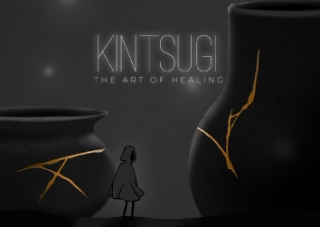
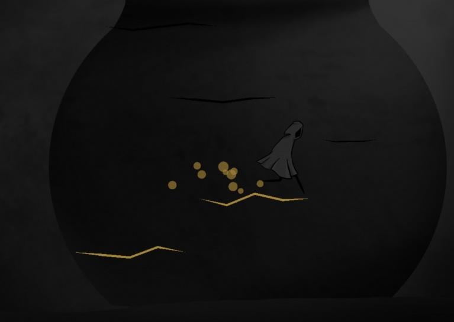

= Kintsugi

Kintsugi is the art of repairing something by making it even more beautiful than before. This game is about a journey into the light, a journey to repair the world around you and finally even repair yourself.

Made during the Global Game Jam 2020

== Credits: 

Programmers - Thilo Voß, Florian Arens, Fabian Weseman

Audio - Alexander Brandt

Art & Design - Kaike Tappe
